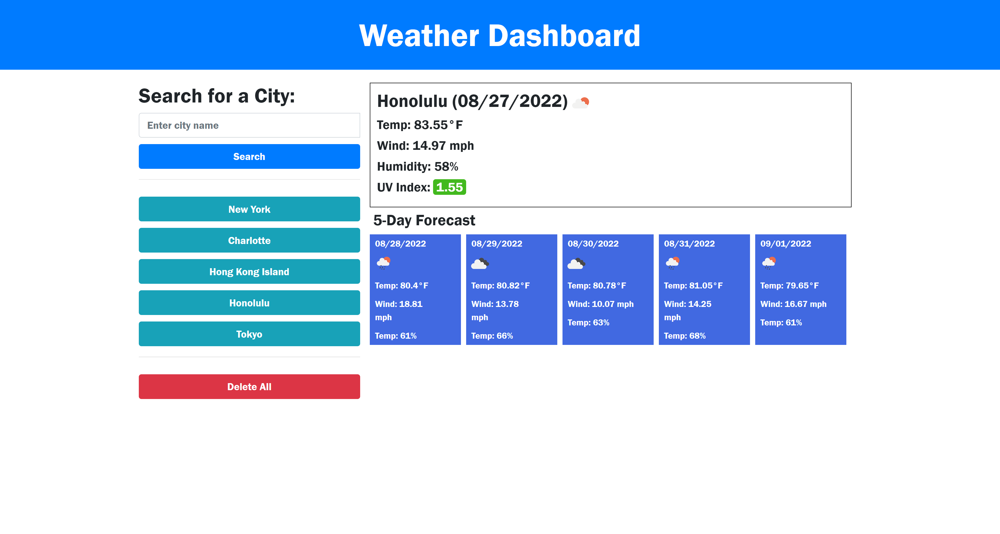

# Weather Dashboard Project

## Table of contents
1. [Description](#description)
2. [Visuals](#visuals)

## Description
This is a weather dashboard using OpenWeathers API. Users can enter the name of a city and see the current weather; the temperature, wind speed, humidity, and UV Index. They can also see the 5 day forcast for that location.

When the users search a city, it is added to a toolbar on the left for easy acccess. The last city viewed will be automatically opened when the page is reloaded. There's also a "Delete All" button to remove all the cities in the toolbar.

[Link to live site](https://bbelk.github.io/weather-dashboard-project/) 

## Visuals
